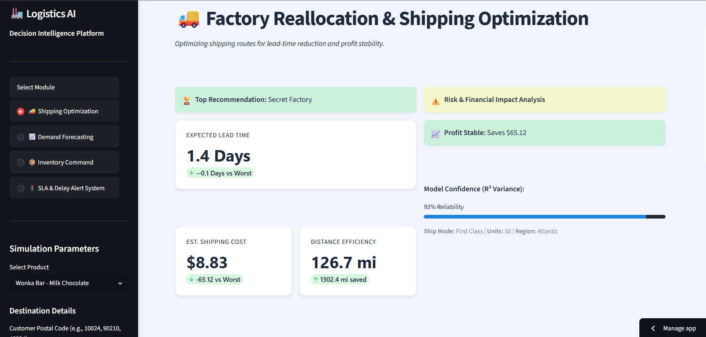
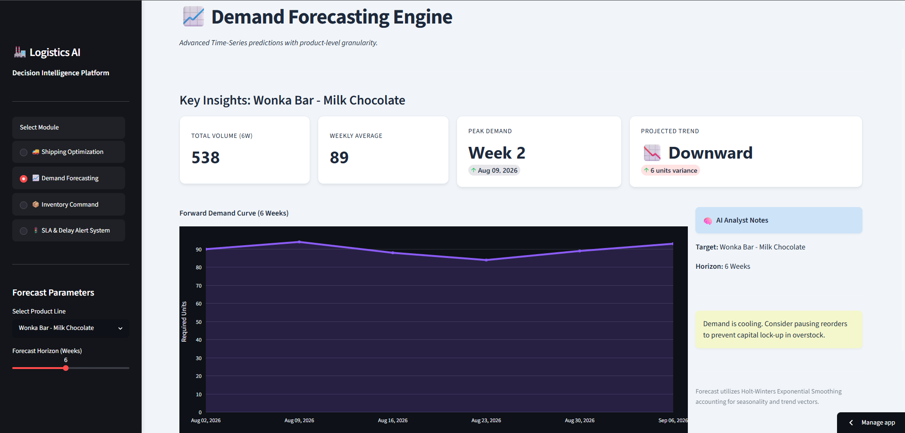
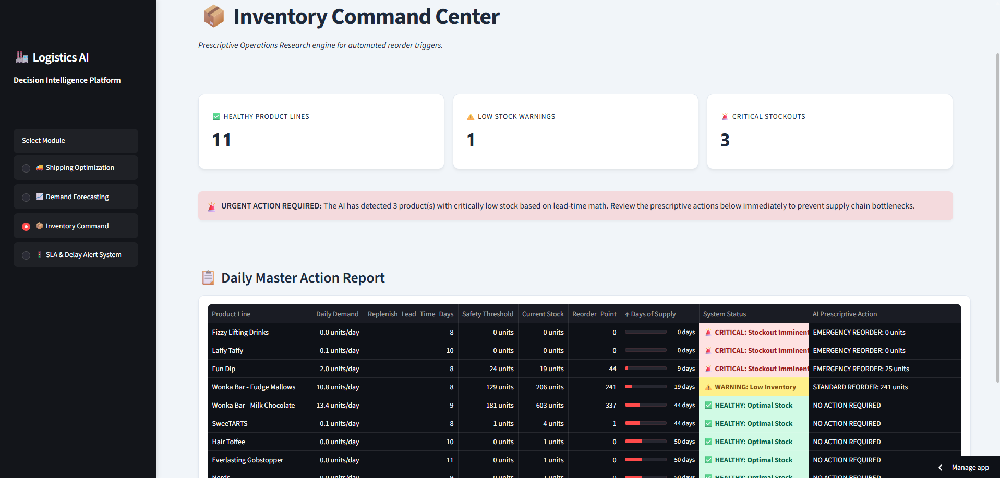
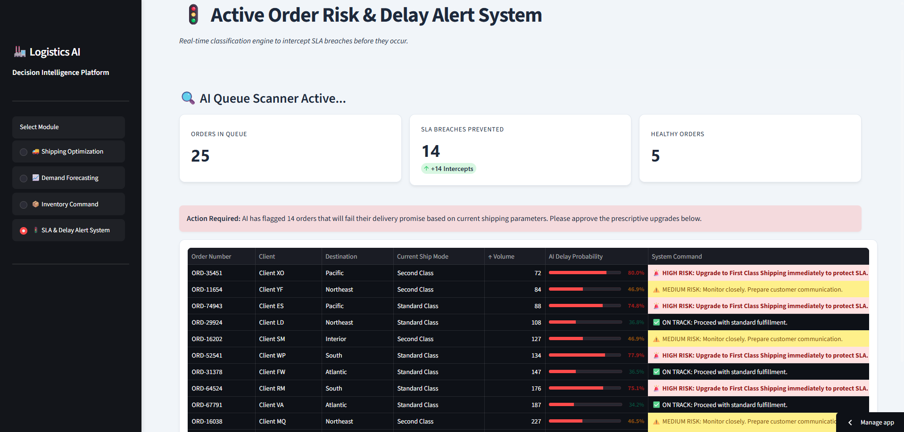

# 🏭 Logistics AI — Supply Chain Intelligence Platform

A decision-intelligence dashboard for supply chain operations, built with Streamlit and four purpose-built ML/OR models — factory reallocation, demand forecasting, inventory reorder logic, and SLA delay risk scoring.

[](https://www.python.org/)
[](https://scikit-learn.org/)
[](https://streamlit.io/)
[](https://github.com/Sahil2171/ai-supply-chain-intelligence)

**Live demo:** [ai-supply-chain-intelligence.streamlit.app](https://ai-supply-chain-intelligence.streamlit.app)
> Streamlit Community Cloud apps sleep after inactivity — if the link shows a "wake up" screen, give it ~30 seconds to spin back up.
---
## 📸 Screenshots

| Shipping Optimization | Demand Forecasting |
|---|---|
|  |  |

| Inventory Command Center | SLA Delay Risk |
|---|---|
|  |  |
---

## Overview

Logistics AI simulates the decision layer a supply chain analyst would use day-to-day: which factory should fulfill an order, how much of each product will sell next month, when to reorder stock, and which live orders are about to breach their SLA. Each module is backed by a real trained model rather than static rules dressed up as "AI" — the specifics are below.

The dataset is the well-known **Nassau Candy Distributor** case-study dataset (Wonka-branded SKUs, US regional shipping records) commonly used in BI/analytics coursework. Good for demonstrating the modeling pipeline end-to-end — worth being upfront that it's not proprietary production data if it comes up in an interview.

---

## 🧠 What's Inside — 4 Modules

### 🚚 Shipping Optimization
- **Model:** Random Forest Regressor predicting lead time in days
- **Engineering:** Haversine great-circle distance from customer ZIP to each of 5 candidate factories, used as a model feature alongside ship mode, region, and order volume
- Runs a "what-if" simulation across all factories and ranks them by a speed-vs-cost priority slider, with a live cost/lead-time comparison chart

### 📈 Demand Forecasting
- **Model:** Holt-Winters Triple Exponential Smoothing, one model per product line
- Forecasts 1–12 weeks ahead, surfaces peak week and trend direction (accelerating vs cooling demand), and flags when safety stock should be raised ahead of a projected peak

### 📦 Inventory Command Center
- **Model:** Deterministic prescriptive rules engine (not ML — and it shouldn't be; reorder logic needs to be auditable)
- Reorder Point = `(Lead Time × Daily Demand) + (Safety Stock × 1.2 risk buffer)`
- Computes Days of Supply remaining per SKU and classifies each as CRITICAL / WARNING / HEALTHY / OVERSTOCK with a recommended action

### 🚦 SLA & Delay Risk Scoring
- **Model:** Random Forest Classifier using `predict_proba()` for a calibrated delay probability, not just a pass/fail label
- Scores a simulated live order queue and recommends a shipping upgrade for any order above a 65% delay-risk threshold

---

## 🛠️ Tech Stack

| Layer | Tools |
|---|---|
| Frontend / App | Streamlit, custom CSS theming |
| Data Processing | Pandas, NumPy |
| Machine Learning | scikit-learn (Random Forest), statsmodels (Holt-Winters) |
| Visualization | Plotly Express |
| Serialization | Pickle |

---

## Quick Start

### Prerequisites
- [Python](https://www.python.org/) 3.11+
- pip

### 1. Clone the repository
```bash
git clone https://github.com/Sahil2171/ai-supply-chain-intelligence.git
cd ai-supply-chain-intelligence
```

### 2. Create and activate a virtual environment
```bash
python -m venv .venv

# Windows
.venv\Scripts\activate

# Mac/Linux
source .venv/bin/activate
```

### 3. Install dependencies
```bash
pip install -r requirements.txt
```

### 4. Run the app
```bash
streamlit run app.py
```

### 5. Open in browser
| URL | Description |
|---|---|
| http://localhost:8501 | Nassau AI dashboard (default Streamlit port) |

> This runs the app against the **pre-trained models already committed** in `models/`. You do not need to retrain anything to use the dashboard — see [Known Limitations](#-known-limitations) if you want to retrain from scratch.

---

## 📂 Project Structure

```
ai-supply-chain-intelligence/
├── app.py                        ← Main Streamlit app (all 4 modules + routing)
├── requirements.txt
├── models/                       ← Pre-trained, pickled models (committed)
│   ├── shipping_regressor.pkl
│   ├── shipping_encoders.pkl
│   ├── demand_forecaster.pkl
│   ├── inventory_engine.pkl
│   └── delay_classifier.pkl
│   └── delay_encoders.pkl
├── data/
│   └── processed/                ← Model-ready CSVs (committed)
│       ├── model1_shipping_data.csv
│       ├── model2_demand_data.csv
│       ├── model3_inventory_data.csv
│       └── final_inventory_report.csv
└── src/                           ← Training / preprocessing scripts
    ├── preprocessing.py
    ├── train_shipping.py
    ├── train_forecasting.py
    ├── train_intentory.py        ← (typo in filename — see below)
    └── train_delay.py
```

---


## 👨‍💻 Author

**Sahil Patil**
- AI/ML Engineer & Data Science Student
- GitHub: [@Sahil2171](https://github.com/Sahil2171)
- LinkedIn: [sahilpatil2171](https://www.linkedin.com/in/sahilpatil2171)

---

*If you find this project useful, consider giving it a ⭐.*
